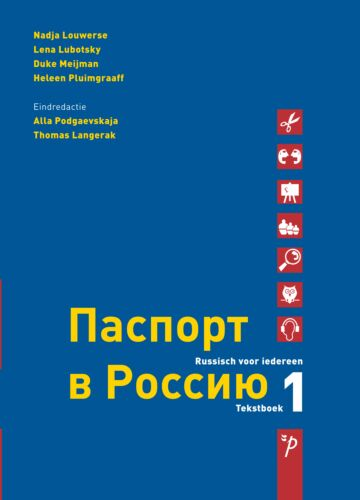

# Paspoort voor Rusland

[Paspoort voor Rusland](https://www.pegasusboek.nl/paspoort-voor-rusland-1-tekstboek.html) is a Russian language course,
available both in English and in Dutch.

The [audio](https://www.pegasusboek.nl/audio) for this course, which is freely available on the publisher's website, has been written down and put in
dialogue exercises. The dialogue exercises, have translations for each line, plus each individual word. In addition,
exercises might be available to test your understanding of the dialogue. This is however not enough to truely learn
Russian. For that the author of this website strongly urges to buy the book and use this website as a learning aid.

The author cannot be held responsible for any mistakes made in writing down the dialogues and the translations. This is
purely the intepretation of the author and the publisher has not been part of this process.

If you see any errors, please don't hesitate to contact me. I greatly appreciate all feedback, and the time you take to
inform me of your opinion, feedback suggestions.

I hope you will find this website useful and that it might be an aid to learn languages fast and pleasant.

André Schepers