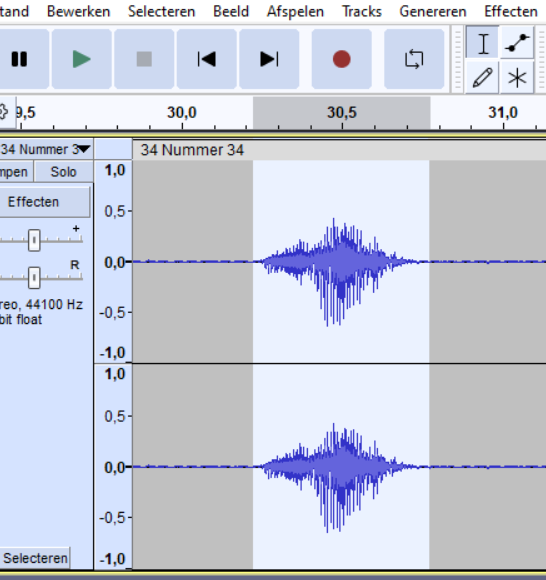
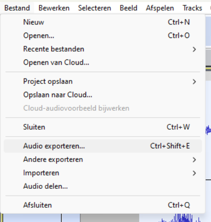

# Actions to turn audio into snippets and Base64

## To html Base64 embedded audio, from Audacity

### Audacity

* Open [Audacity](https://www.audacityteam.org/)
and open the audio file you desire to turn into Base64 string.

* Select a part of the audio
  

* Go to the menu and select the option to export audio.
  

### Bash (CLI): .ogg to base64 string

Now it is time to convert the .ogg file created in the previous set of
steps, to a base64 string, stored in a target file (cli might cut off
the string if it becomes too long).

```bash
echo "data:audio/ogg;base64,$(base64 -w 0 audacity-audio-export.ogg)" > base64.txt
```
